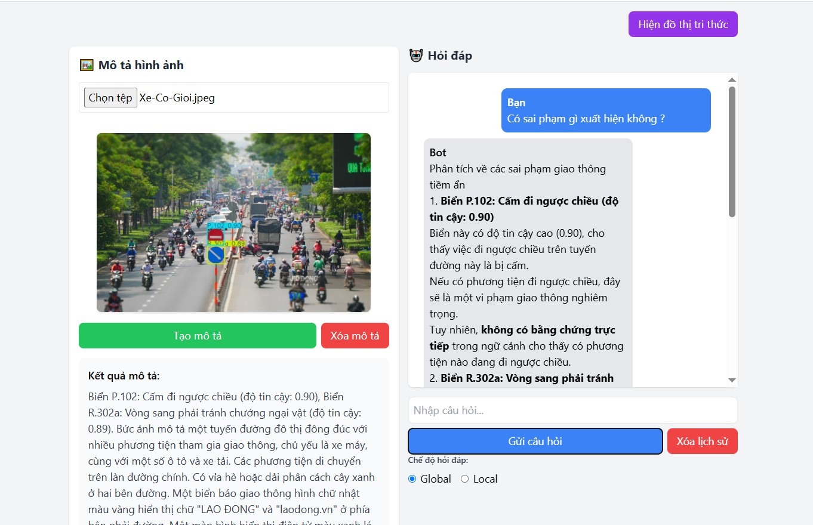

# 🚦 nano-graphrag: Graph-based RAG & Traffic Law Assistant

**nano-graphrag** là một dự án mã nguồn mở cung cấp các công cụ và ví dụ về Retrieval-Augmented Generation (RAG) dựa trên đồ thị tri thức, hỗ trợ cả tiếng Việt và tiếng Anh, tích hợp nhận diện biển báo giao thông bằng YOLO, sinh mô tả ảnh, hỏi đáp luật giao thông, và trực quan hóa đồ thị tri thức.

## 🌟 Tính năng nổi bật

- **GraphRAG**: Triển khai RAG dựa trên đồ thị tri thức, hỗ trợ nhiều chế độ truy vấn (global, local, naive RAG).
- **Nhận diện biển báo giao thông**: Sử dụng YOLO để phát hiện và mô tả biển báo trên ảnh.
- **Sinh mô tả ảnh**: Tích hợp mô hình caption cho ảnh giao thông.
- **Hỏi đáp luật giao thông**: Chatbot hỗ trợ hỏi đáp dựa trên ngữ cảnh và mô tả ảnh.
- **Trực quan hóa đồ thị tri thức**: Hiển thị đồ thị tri thức từ file GraphML với D3.js.
- **Giao diện web**: Xây dựng bằng FastAPI + HTML + TailwindCSS, dễ sử dụng và mở rộng.

## 🚀 Cài đặt

### Yêu cầu

- Python >= 3.9
- Các thư viện trong requirements.txt

### Cài đặt

```bash
git clone https://github.com/hoangbao1102/QA-Traffic-Law.git
cd nano-graphrag
pip install -r requirements.txt
```

## 🏁 Khởi động ứng dụng web

```bash
python testing_demo/main.py
```
Hoặc nếu muốn dùng uvicorn (khuyến nghị cho FastAPI):

```bash
cd testing_demo
uvicorn main:app --reload
```

Truy cập [http://localhost:8000](http://localhost:8000) để sử dụng giao diện.



## 🖼️ Nhận diện & mô tả ảnh giao thông

- Tải ảnh lên ở ô "Mô tả hình ảnh".
- Ảnh sẽ được nhận diện biển báo bằng YOLO, sinh mô tả và hiển thị ảnh đã xử lý.
- Có thể dùng mô tả này làm ngữ cảnh cho chatbot hỏi đáp.

## 💬 Chatbot hỏi đáp luật giao thông

- Nhập câu hỏi ở ô "Hỏi đáp".
- Có thể chọn chế độ truy vấn: **Global**, **Local**.
- Nếu đã có mô tả ảnh, chatbot sẽ dùng làm ngữ cảnh để trả lời chính xác hơn.

## 🕸️ Đồ thị tri thức

- Nhấn nút **Hiện đồ thị tri thức** để xem trực quan hóa đồ thị từ file GraphML.
- Đồ thị được sinh tự động từ dữ liệu và có thể tùy biến.

## 📁 Cấu trúc thư mục

```
nano-graphrag/
│
├── nano_graphrag/           # Thư viện core GraphRAG
├── testing_demo/            # Demo FastAPI, YOLO, chatbot, visualization
│   ├── main.py              # FastAPI app chính
│   ├── graphml_test.py      # Sinh đồ thị từ GraphML
│   ├── templates/           # HTML templates
│   └── static/              # File tĩnh (ảnh, js, ...)
├── static/                  # Ảnh upload (nếu dùng ngoài demo)
├── requirements.txt
├── setup.py
└── readme.md
```

## ⚙️ Một số ví dụ sử dụng

### Truy vấn RAG bằng Python

```python
from nano_graphrag import GraphRAG, QueryParam

graph_func = GraphRAG(working_dir="./mygraph")
graph_func.insert("Nội dung văn bản hoặc tài liệu luật giao thông...")

# Truy vấn global
print(graph_func.query("Quy định về vượt đèn đỏ là gì?"))

# Truy vấn local
print(graph_func.query("Quy định về vượt đèn đỏ là gì?", param=QueryParam(mode="local")))
```

### Sinh đồ thị tri thức từ GraphML

```python
from testing_demo.graphml_test import visualize_graphml
visualize_graphml(
    "traffic_law_deepseek/graph_chunk_entity_relation.graphml",
    "testing_demo/templates/graph_visualization.html"
)
```